# 🚕 UberGo — Real-Time Ride Booking Platform

<p align="center">
  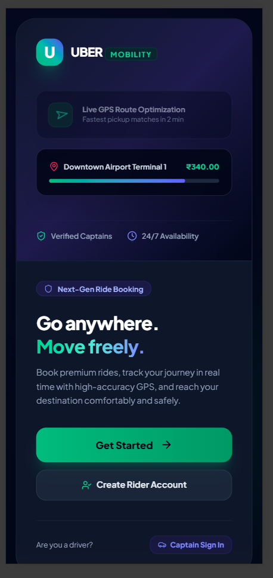
</p>

<h3 align="center">A modern ride-booking platform with Rider & Captain workflows</h3>

<p align="center">
  <b>Ride Booking • GPS Maps • Captain Matching • OTP Verification • Live Tracking • Chat • Navigation • Payment</b>
</p>

---

## 📌 Overview

**UberGo** is a ride-booking platform inspired by modern ride-hailing applications. The project demonstrates an end-to-end ride lifecycle with two separate user experiences:

- 👤 **Rider**
- 🧑‍✈️ **Captain**

The Rider can select pickup and destination locations, view routes, choose a ride category, review the fare, request a ride, communicate with the Captain, verify the ride using an OTP, track the trip, and handle cancellation.

The Captain can log in, go online/offline, receive ride requests, accept or ignore requests, view passenger and trip information, navigate to the pickup point, verify the passenger OTP, start and complete the trip, and collect the fare.

> **Note:** UberGo is an independent portfolio/educational project inspired by ride-hailing workflows. It is not the official Uber application.

---

## ✨ Highlights

### 👤 Rider Experience

- Rider login and account creation
- Pickup and destination selection
- Current GPS/location option
- Interactive map
- Route visualization
- Ride category selection
- Fare display
- Ride confirmation
- Nearby Captain search
- Captain matching
- Captain details and rating
- Live ride status
- OTP/PIN-based ride start verification
- Rider–Captain chat
- Ride cancellation
- Cancellation reason selection
- Trip tracking
- Payment/fare display

### 🧑‍✈️ Captain Experience

- Captain login and registration
- Online/offline availability
- Captain dashboard
- Current location map
- Incoming ride requests
- Accept / Ignore ride request
- Passenger details
- Pickup and destination information
- Call / Message actions
- Navigation mode
- Passenger OTP verification
- Ride start and trip management
- Destination completion
- Payment collection
- Earnings/ride information

---

## 🚕 Ride Categories

The UI demonstrates multiple ride categories:

| Ride | Example Fare | Example ETA | Description |
|---|---:|---|---|
| 🚗 UberGo | ₹198 | 2–4 min | Comfortable sedan |
| 🛵 Moto | ₹104 | 1–3 min | Fast solo ride |
| 🛺 Uber Auto | ₹132 | 2–5 min | Affordable auto |

> These values are demonstration values shown in the project UI and are not live commercial fares.

---

## 🔄 Complete Ride Lifecycle

```text
┌─────────────────────┐
│     Rider Login     │
└──────────┬──────────┘
           ↓
┌─────────────────────┐
│ Select Pickup       │
│ & Destination       │
└──────────┬──────────┘
           ↓
┌─────────────────────┐
│ View Route on Map   │
└──────────┬──────────┘
           ↓
┌─────────────────────┐
│ Choose Ride Type    │
└──────────┬──────────┘
           ↓
┌─────────────────────┐
│ Confirm Fare/Route  │
└──────────┬──────────┘
           ↓
┌─────────────────────┐
│ Request Ride        │
└──────────┬──────────┘
           ↓
┌─────────────────────┐
│ Search Captains     │
└──────────┬──────────┘
           ↓
┌─────────────────────┐
│ Captain Accepts     │
└──────────┬──────────┘
           ↓
┌─────────────────────┐
│ Captain On The Way  │
└──────────┬──────────┘
           ↓
┌─────────────────────┐
│ Captain Arrives     │
└──────────┬──────────┘
           ↓
┌─────────────────────┐
│ OTP Verification    │
└──────────┬──────────┘
           ↓
┌─────────────────────┐
│ Ride Starts         │
└──────────┬──────────┘
           ↓
┌─────────────────────┐
│ Trip In Progress    │
└──────────┬──────────┘
           ↓
┌─────────────────────┐
│ Destination Reached │
└──────────┬──────────┘
           ↓
┌─────────────────────┐
│ Payment Collection  │
└──────────┬──────────┘
           ↓
┌─────────────────────┐
│ Ride Completed      │
└─────────────────────┘
```

---

## ❌ Cancellation Workflow

The project also demonstrates cancellation handling:

```text
Ride Requested
      ↓
Cancel Ride
      ↓
Select Cancellation Reason
      ↓
Confirm Cancellation
      ↓
Ride Cancelled
```

Example reasons:

- Wrong pickup location
- Too far away
- Vehicle issue
- Emergency
- Other

---

## 🗺️ Maps & Location

The interface uses an interactive map experience with **Leaflet and OpenStreetMap** attribution.

The map screens demonstrate:

- 📍 Current location
- 🟢 Captain/vehicle location
- 📌 Pickup point
- 🏁 Destination
- 🛣️ Route visualization
- 🔍 Zoom controls
- 🧭 Current-location control
- 🚕 Captain navigation mode
- 📍 Trip-progress map

---

## 🔐 Authentication & Verification

The UI contains separate authentication experiences for:

### Rider

```text
Rider Login
   ↓
Rider Account
   ↓
Book Ride
```

### Captain

```text
Captain Login
   ↓
Captain Dashboard
   ↓
Go Online
   ↓
Receive Ride Requests
```

### Ride OTP

Before starting the ride, the Captain verifies the passenger's 4-digit ride PIN.

```text
Captain Arrives
      ↓
Enter Passenger PIN
      ↓
Verify OTP
      ↓
Start Ride
```

---

## 💬 Rider–Captain Communication

UberGo demonstrates in-ride communication between Rider and Captain.

The interface includes:

- Online status
- Ride chat
- Message input
- Send message
- Call action
- Passenger/Captain information

---

## 🧑‍✈️ Captain Availability

Captains can control their availability:

```text
             ┌─────────────┐
             │   OFFLINE   │
             └──────┬──────┘
                    │
                 Go Online
                    ↓
             ┌─────────────┐
             │   ONLINE    │
             └──────┬──────┘
                    │
             Receive Requests
                    ↓
             Accept / Ignore
                    ↓
             Manage Ride
                    │
                 Go Offline
                    ↓
             ┌─────────────┐
             │   OFFLINE   │
             └─────────────┘
```

---

## 💳 Payment Collection

The Captain workflow includes a payment collection step after reaching the destination.

The UI demonstrates:

- Total fare
- Cash payment
- Online/UPI payment option
- Payment confirmation
- Trip earnings

Example:

```text
Total Fare: ₹198

[ Collected Cash Payment ]
[ Show QR / Collect Online UPI ]
```

> Payment screens in this portfolio project are workflow demonstrations unless a real payment gateway is explicitly configured.

---

## 🧩 Application Modules

```text
UberGo
│
├── Authentication
│   ├── Rider Login
│   ├── Rider Registration
│   ├── Captain Login
│   └── Captain Registration
│
├── Rider Module
│   ├── Location Selection
│   ├── Destination Selection
│   ├── Map
│   ├── Ride Selection
│   ├── Fare Review
│   ├── Ride Request
│   ├── Captain Matching
│   ├── Ride Tracking
│   ├── Chat
│   └── Cancellation
│
├── Captain Module
│   ├── Online / Offline
│   ├── Captain Dashboard
│   ├── Ride Requests
│   ├── Accept / Ignore
│   ├── Passenger Details
│   ├── Navigation
│   ├── OTP Verification
│   ├── Trip Management
│   └── Payment Collection
│
└── Map Module
    ├── GPS Location
    ├── Pickup Marker
    ├── Destination Marker
    ├── Route
    └── Navigation
```

---

## 🏗️ High-Level Architecture

```text
                         ┌────────────────────┐
                         │       Rider        │
                         │   Web Interface    │
                         └─────────┬──────────┘
                                   │
                                   ▼
                         ┌────────────────────┐
                         │     Frontend       │
                         │                    │
                         │ Booking UI         │
                         │ Maps               │
                         │ Ride States        │
                         │ Captain Tracking   │
                         └─────────┬──────────┘
                                   │
                                   ▼
                         ┌────────────────────┐
                         │ Application / API  │
                         │      Layer         │
                         └─────────┬──────────┘
                                   │
                  ┌────────────────┼────────────────┐
                  │                │                │
                  ▼                ▼                ▼
          ┌──────────────┐ ┌──────────────┐ ┌──────────────┐
          │    Maps      │ │ Real-Time /  │ │  Persistence │
          │ Leaflet +    │ │ Ride Events  │ │  / Database  │
          │ OpenStreetMap│ │              │ │              │
          └──────────────┘ └──────────────┘ └──────────────┘
                                   │
                                   ▼
                         ┌────────────────────┐
                         │      Captain       │
                         │     Dashboard      │
                         └────────────────────┘
```

> The exact backend, database, authentication library, and real-time transport should be documented according to the implementation in the source code. This README does not claim technologies that are not visible from the provided UI.

---

## 🛠️ Technology

### Confirmed from the UI

- Leaflet
- OpenStreetMap
- Responsive web UI
- GPS/location-based map experience

### Add the technologies used by your source code

Update this list if applicable:

```text
Frontend:
- React.js / Next.js
- JavaScript / TypeScript
- HTML5
- CSS3

Backend:
- Node.js
- Express.js

Database:
- MongoDB / PostgreSQL / MySQL

Real-Time:
- Socket.IO / WebSocket

Authentication:
- JWT
- Password Hashing

Tools:
- Git
- GitHub
- VS Code
```

---

## 📱 Responsive UI

The interface is designed around a mobile-first ride-booking experience and contains dedicated screens for:

- Rider authentication
- Rider booking
- Ride selection
- Captain authentication
- Captain dashboard
- Ride requests
- OTP verification
- Chat
- Cancellation
- Trip tracking
- Captain navigation
- Payment collection

---

# 📸 Screenshots

## 🏠 Rider Landing / Home

<p align="center">
  
</p>

---

## 🔐 Rider Login

<p align="center">
  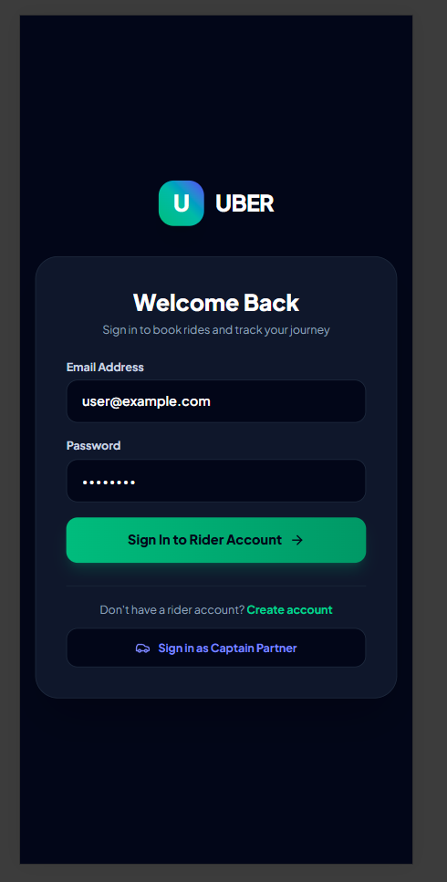
</p>

---

## 📍 Find a Ride

<p align="center">
  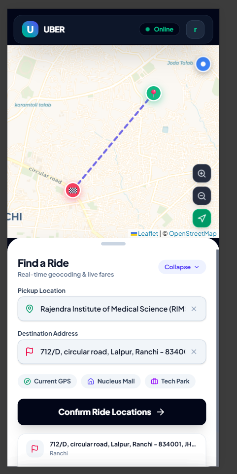
</p>

---

## 🧑‍✈️ Captain Login

<p align="center">
  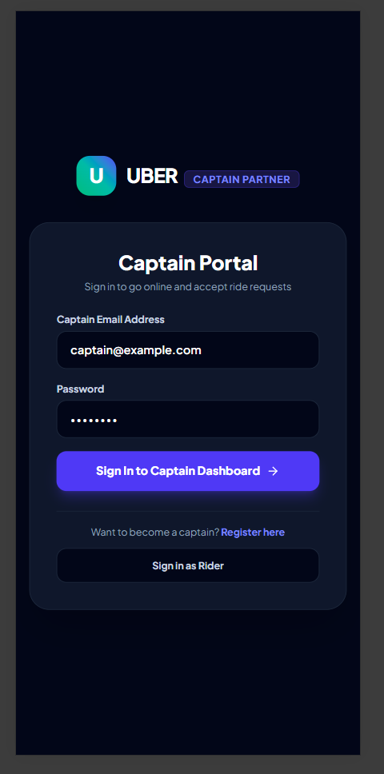
</p>

---

## 🟢 Captain Dashboard — Online

<p align="center">
  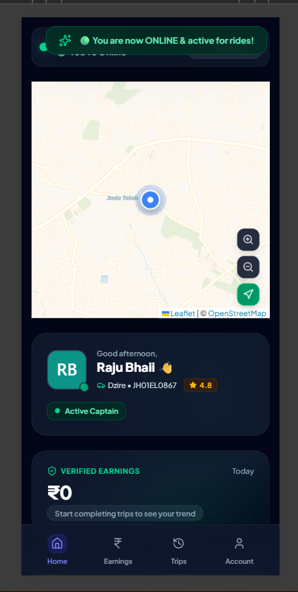
</p>

---

## 🧑‍✈️ Captain Dashboard

<p align="center">
  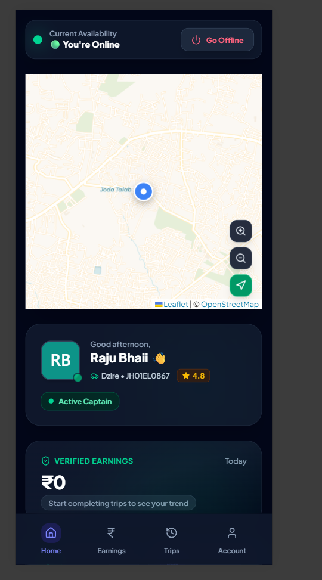
</p>

---

## 🚕 Choose a Ride

<p align="center">
  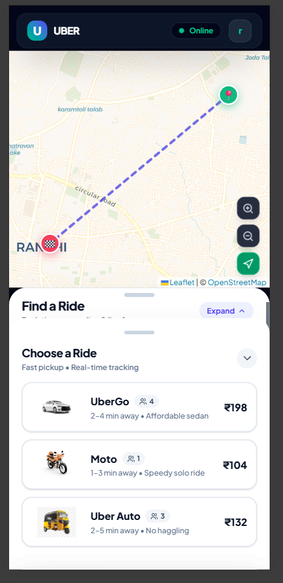
</p>

---

## ✅ Confirm Ride

<p align="center">
  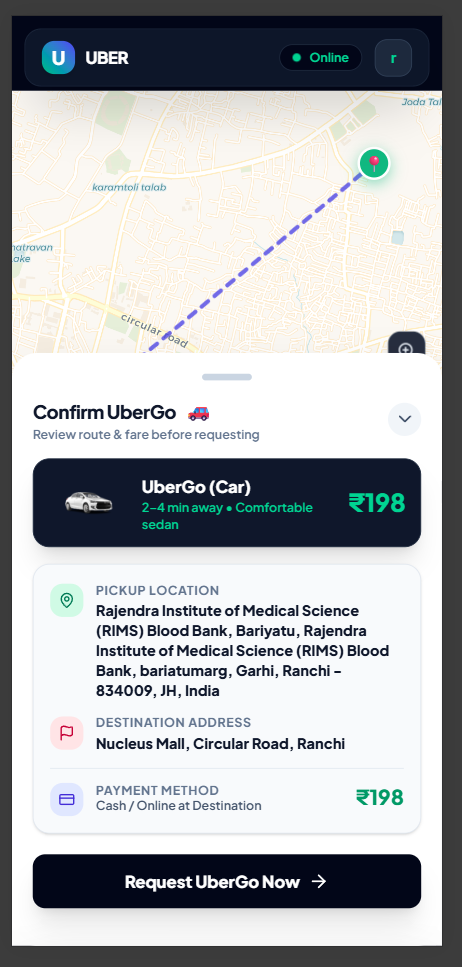
</p>

---

## 🔎 Searching for Captain

<p align="center">
  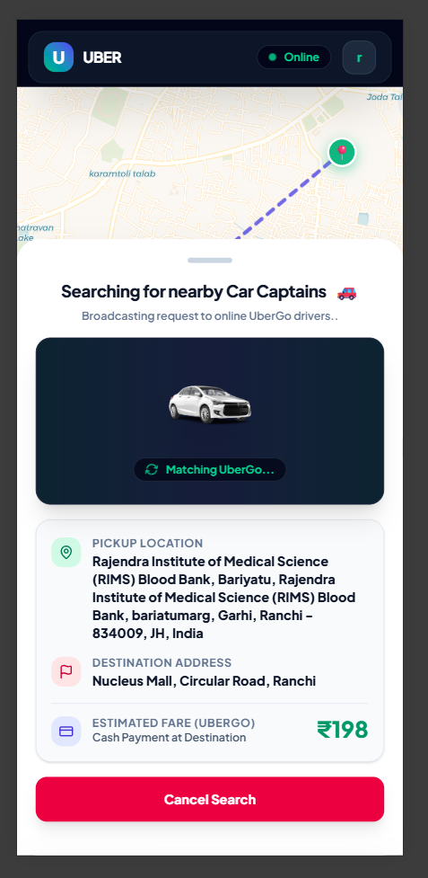
</p>

---

## 📩 Incoming Captain Ride Request

<p align="center">
  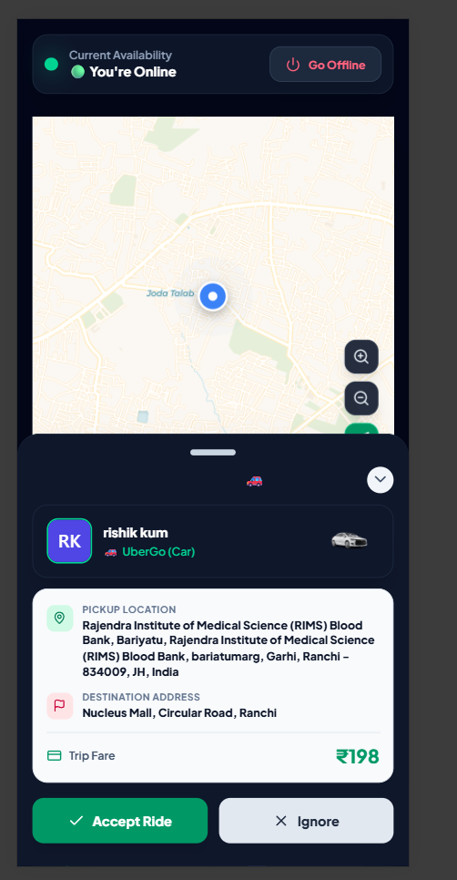
</p>

---

## 🚗 Captain on the Way

<p align="center">
  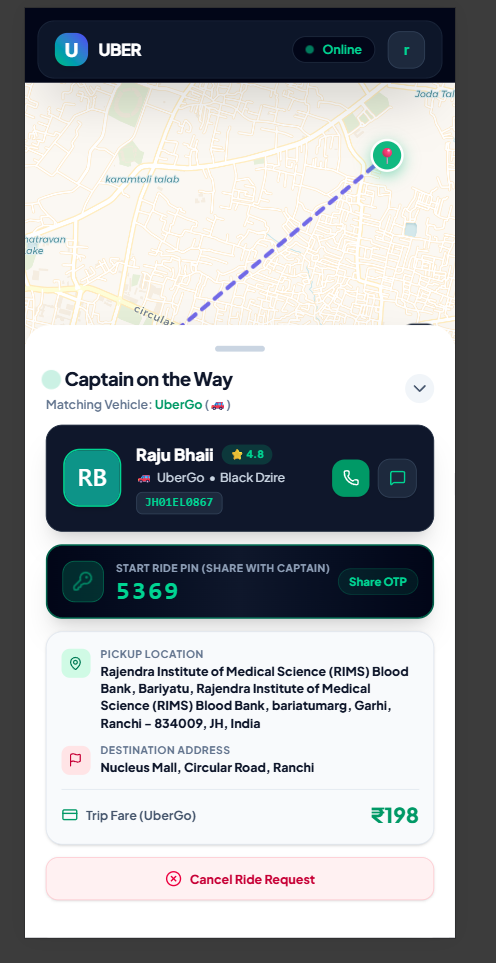
</p>

---

## 🔢 OTP Verification

<p align="center">
  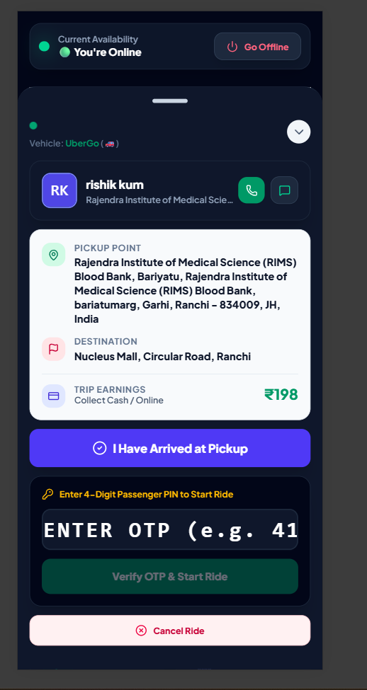
</p>

---

## 💬 Rider–Captain Chat

<p align="center">
  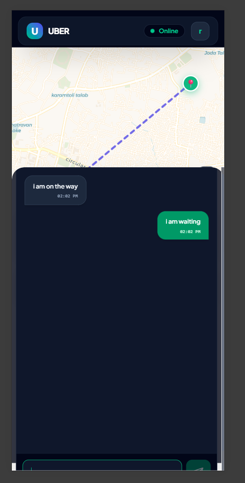
</p>

---

## ❌ Cancel Ride

<p align="center">
  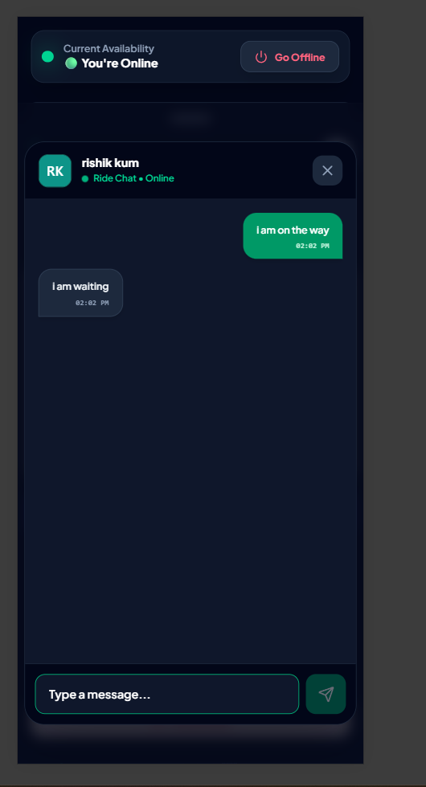
</p>

---

## 🚫 Ride Cancelled

<p align="center">
  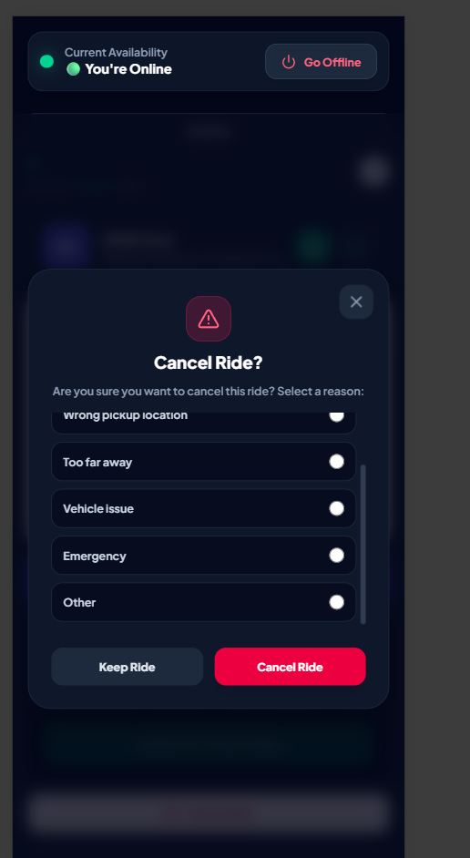
</p>

---

## 🚕 Trip in Progress

<p align="center">
  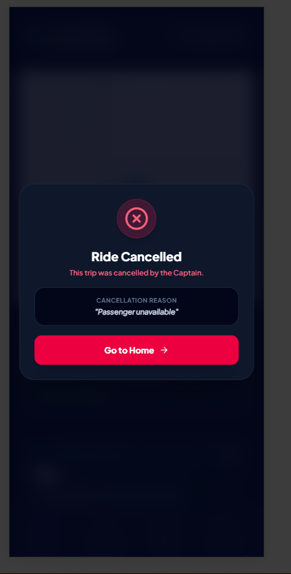
</p>

---

## 🧭 Captain Navigation Mode

<p align="center">
  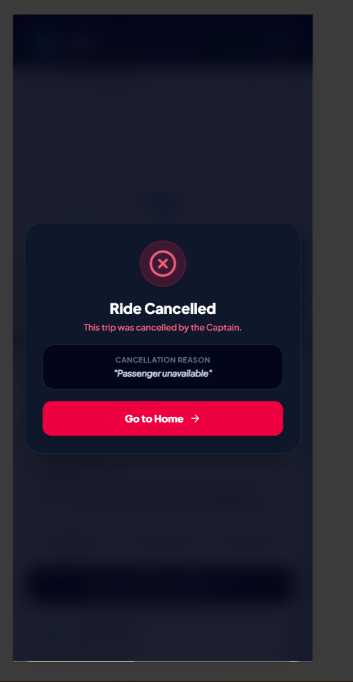
</p>

---

## 💰 Payment Collection

<p align="center">
  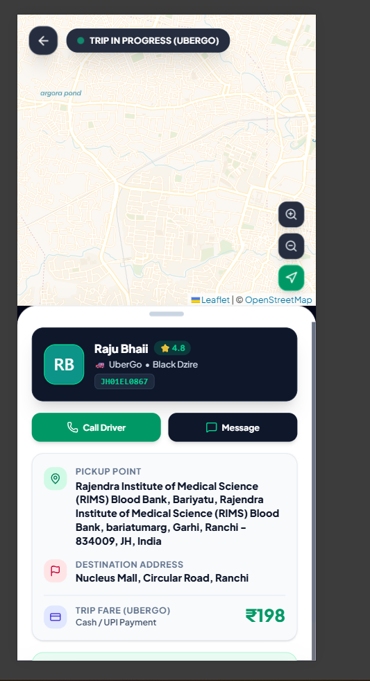
</p>

---

## 💳 Payment Confirmation

<p align="center">
  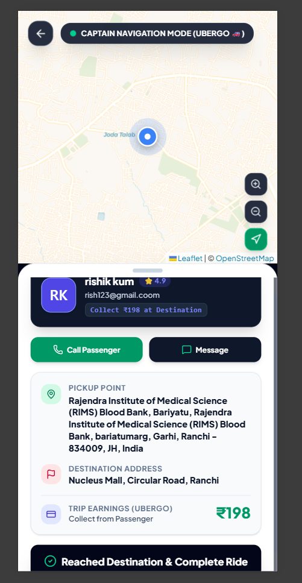
</p>

---

## 📱 Final Application Screen

<p align="center">
  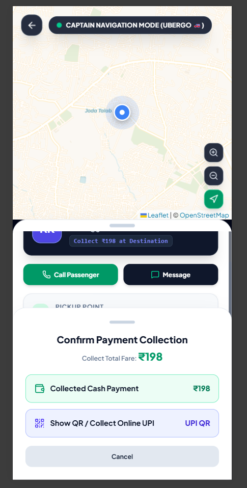
</p>

---

# 🎯 Project Objectives

The project was built to demonstrate practical implementation of:

- Full-stack application workflows
- Rider and Captain role separation
- Ride lifecycle management
- GPS/location handling
- Interactive mapping
- Route visualization
- Vehicle selection
- Fare estimation
- Captain availability
- Ride matching
- OTP verification
- Real-time communication
- Cancellation handling
- Navigation
- Payment workflow
- Responsive UI design

---

# 🧠 Technical Concepts Demonstrated

- Authentication
- Authorization / role-based workflows
- State management
- Location services
- GPS-based UI
- Interactive maps
- Route visualization
- Ride matching
- Real-time ride states
- OTP verification
- Chat workflow
- Cancellation handling
- Navigation workflow
- Payment workflow
- Responsive design
- Component-based UI architecture

---

# 🚀 Getting Started

Clone the repository:

```bash
git clone https://github.com/YOUR-USERNAME/ubargo.git
cd ubargo
```

Install dependencies according to the project:

```bash
npm install
```

Start the development server:

```bash
npm run dev
```

If your project uses a different command, replace the command above with the actual command from your `package.json`.

---

# ⚙️ Environment Variables

If your application uses environment variables, create:

```text
.env
```

Example:

```env
# API
API_URL=

# Database
DATABASE_URL=

# Authentication
JWT_SECRET=

# Maps
MAP_API_KEY=

# Real-Time
SOCKET_URL=
```

> Never commit real passwords, API keys, JWT secrets, database credentials, or other sensitive values to GitHub.

---

# 📁 Suggested Repository Structure

```text
ubargo/
│
├── src/
│   ├── components/
│   ├── pages/
│   ├── services/
│   ├── hooks/
│   ├── utils/
│   └── ...
│
├── public/
│
├── screenshots/
│   ├── 01-home.png
│   ├── 02-rider-login.png
│   ├── 03-rider-find-ride.png
│   ├── 04-captain-login.png
│   ├── 05-captain-dashboard-online.png
│   ├── 06-captain-dashboard.png
│   ├── 07-choose-ride.png
│   ├── 08-confirm-ride.png
│   ├── 09-searching-captain.png
│   ├── 10-incoming-ride-request.png
│   ├── 11-captain-on-way.png
│   ├── 12-otp-verification.png
│   ├── 13-ride-chat.png
│   ├── 14-cancel-ride.png
│   ├── 15-ride-cancelled.png
│   ├── 16-trip-in-progress.png
│   ├── 17-captain-navigation.png
│   ├── 18-captain-payment.png
│   ├── 19-captain-payment-confirmation.png
│   └── 20-final-screen.png
│
├── README.md
├── .gitignore
├── package.json
└── ...
```

---

# 🔮 Future Improvements

Planned improvements can include:

- [ ] Real payment gateway integration
- [ ] Push notifications
- [ ] Advanced route optimization
- [ ] Ride scheduling
- [ ] Ride history
- [ ] Ratings and reviews
- [ ] Driver heatmaps
- [ ] Admin dashboard
- [ ] Analytics dashboard
- [ ] Surge pricing
- [ ] Fraud detection
- [ ] Docker containerization
- [ ] CI/CD pipeline
- [ ] Cloud deployment
- [ ] Prometheus monitoring
- [ ] Grafana dashboards
- [ ] Kubernetes deployment
- [ ] Automated testing

---

# 🔒 Security Notes

For production deployment:

- Store secrets in environment variables
- Never commit `.env` files
- Hash passwords securely
- Validate all API inputs
- Implement proper authorization
- Protect ride and user endpoints
- Validate OTP attempts
- Add rate limiting
- Secure WebSocket connections
- Use HTTPS
- Validate payment status on the server

---

# 🧪 Testing

Recommended testing areas:

```text
Authentication
├── Rider login
├── Captain login
└── Invalid credentials

Ride Booking
├── Pickup selection
├── Destination selection
├── Vehicle selection
└── Fare calculation

Captain Matching
├── Online Captain
├── Ride request
├── Accept
└── Ignore

Ride Lifecycle
├── Captain on way
├── Captain arrived
├── OTP verification
├── Ride started
└── Destination reached

Cancellation
├── Rider cancellation
├── Cancellation reason
└── Cancel confirmation

Payment
├── Fare display
├── Cash collection
└── Online payment workflow
```

---

# 📊 Example Ride Data

```json
{
  "rider": "rishik kum",
  "vehicle": "UberGo",
  "pickup": "Rajendra Institute of Medical Science (RIMS), Ranchi",
  "destination": "Nucleus Mall, Circular Road, Ranchi",
  "fare": 198,
  "status": "in_progress"
}
```

> Example data is for demonstration only.

---

# 👨‍💻 Author

## Rishikant Kumar

**DevOps & Software Engineer**

- GitHub: [@rishikant0](https://github.com/rishikant0)
- LinkedIn: Add your LinkedIn profile
- Email: `kumarrishikant660@gmail.com`

---

# ⭐ Project

If you find this project useful or interesting, consider giving the repository a ⭐.

---

## 📜 Disclaimer

UberGo is an independent educational and portfolio project inspired by common ride-hailing application workflows.

It is not affiliated with, sponsored by, or endorsed by Uber Technologies Inc.

All product names, trademarks, and brand references belong to their respective owners.
